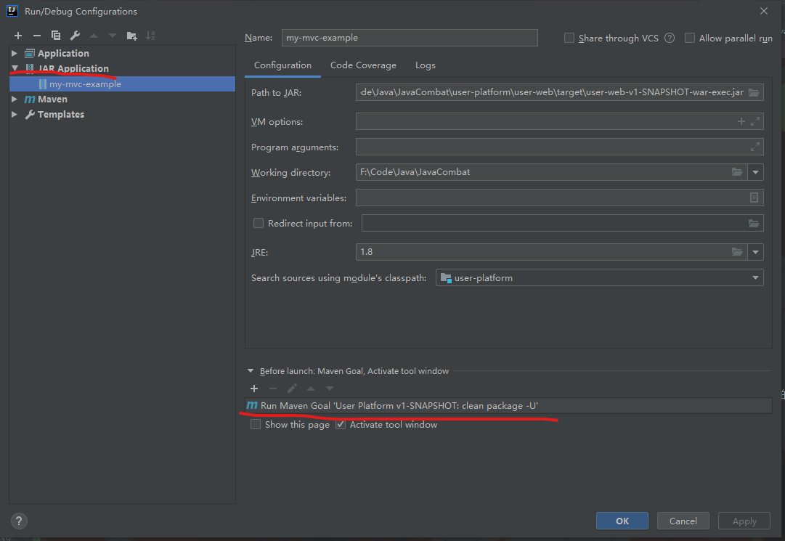

# 第一周作业
***
[作业文档链接](https://github.com/lw1243925457/JavaCombat/blob/main/doc/%E4%BD%9C%E4%B8%9A/%E7%AC%AC%E4%B8%80%E5%91%A8%E4%BD
%9C%E4%B8%9A.md)

## 作业要求
- 通过自研 Web MVC 框架实现（可以自己实现）一个用户注册，forward 到一个成功的页面（JSP 用法）
    - /register
- 通过 Controller -> Service -> Repository 实现（数据库实现）
- （非必须）JDNI 的方式获取数据库源（DataSource），在获取 Connection

## 作业运行测试

```shell script
# 进入user-platform目录
cd user-platform
mvn clean package -U
java -jar .\user-web\target\user-web-v1-SNAPSHOT-war-exec.jar
```

**时间有点紧，目前注册只能使用数字(就是用户和密码目前只能填写数字），不支持英文，后面有时间再debug下，感觉是H2的使用问题**

按照上面的命令运行相应的程序后，访问用户注册链接：http://localhost:8080/register

成功后成功跳转到用户登录页面

## 作业心得记录
### 调试相关
自己前面也遇到了调试相关的问题，经过探索，IDEA可以自己配置运行打包后的jar，然后就能正常接管调试，相关设置界面如下：

左上角+号找到添加jar运行，然后设置jar包路径

还有一个关键的是右下角的运行前的动作，选择+号，如果选择maven，输入:clean package -U 即可



### JSP相关
完成该作业需要对JSP有一些认识，推荐阅读下面一本书籍，快速浏览前七章即可

- 《Servlet、JSP和Spring MVC初学指南》：详细展示了相关的基础概念，并从中能得到演化轨迹，利于我们的程序的编写

如何写过前端，说白了JSP其实就是前端页面（在当前情况看前后端是没有分离的），从JSP页面中可以设计跳转链接（也就是路由），还有模板渲染之类的

这里也没有必要去深入学习，大致了解就行了，有个认识即可

这次作业就添加下面几个简单的JSP页面：

- register.jsp :用户注册页面
- login.jsp ：用户登录页面
- failed.jsp ：失败页面

### 数据库相关
这次数据相关的细节其实老师都基本写好了，拿来即用即可

编写流程大致如下：

- 初始化数据库数据源：这里derby使用不方便，直接使用的H2
- Controllers相关编写：调用Service
- Service相关编写：调用Repository
- Repository相关编写：这里模仿Mybatis，直接在方法上写一下信息，然后使用JDK代理，在代理中进行统一的处理

目前完成了简单插入和查询的接口，后序再对代码进行调整和优化（时间问题，看起来有点乱）

细节请查询下面的文章记录：

- [基于Servlet的MVC框架Dome（二）：数据库初步](https://juejin.cn/post/6934593905954390024/)

